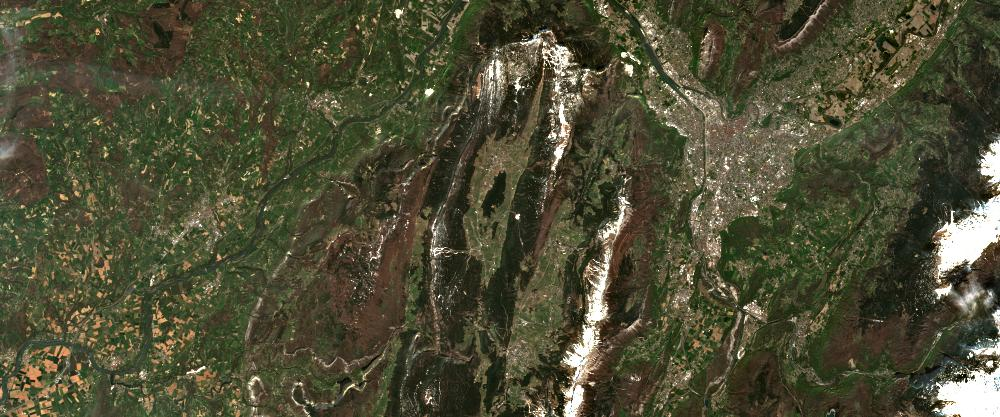

# Project Specification and Documentation

## Introduction
This project utlilizes [Python](https://www.python.org/) to generate and visualize spatio-temporal earth data using transparent [WCPS](https://earthserver.eu/wcs/) query from the [Rasdaman Datacube](https://standards.rasdaman.com/), a multi-dimensional array database. It showcases the processing of datacube objects through a range of WCPS operations and functions with query generation from Python code using object-oriented approach.  The project is implemented by a rapid software development approach with pair and extreme programming practices. The project emphasizes collaboration and teamwork accross sprint cycles to achieve the planned outcomes. 

## Project Scope
+ This project using WCS and WCPS query requests to process the datacube data with a list of operations, including access, subsetting, processing, aggregation, fusion and encoding. 
+ Acknowledgments: We extend our grateful to following persons for the guidance throughout the project
  - Prof. Peter Baumann
  - Eremina Elizaveta
  - Sirotkina Veronika
  - Getahun Raey Addisu

---

## Table of Contents

   - [System Design](#system-design)
   - [Previous Work](#implementation)
   - [Additions](#current-improvements)
   - [Authors](#authors)
 
---

## System Design 

+ Python Library dbc (database connection object) and dco (datacube object) provides a list of the object methods to execute the WCS/WCPS operations with a selection menu as the interface of the WCPS queries
  - Former `dbc.py`, a library to define the database connection object and URL with database connection URL as the input parameter and `dco.py` , a libary to to define the DataCube class and object to store and execute the datacube operations and queries with input parameters as the query variables, has been combined into one library, namely [`wdc.py`](src/wdc/wdc.py). This library allows, in addition to exisiting aggregate operations:
    - to create **multilple coverages** using **`Coverage`** class without being restricted to only one as previously,
    - to construct a new **coverage** on the fly with the help of the class **`CoverageConstructor`**, while doing the operation,
    - color coding with **`RGBColor`**, as well as
    - define your own `switch cases` with **`Switch`** and **`Case`** classes.
  
  The library system design is shown through **UML class** & **swimlane diagram**.  
  
 + [UML Class Diagram](diagram/uml_class.png)
 + [Swimlane Diagram](diagram/swimlane.png)

   
 + Implementation Schedule and Plan
   - Sprint#1(8 April to 18 April , 2 weeks):
     - Define project scope, project plan, project design, implementation schedule and setup the environment with some operations and functions, source codes and test cases
   - Sprint#2(19 April to 7 May, 2.5 weeks):
     - create dco.py and dbc.py class and object library and modify the original code base
     - change the database connect url, datacube name and query values as variables instead of hardcoded values
     - Implement the rest of the operations and features and perform unit testing
     - revise the documentation in accordance to the changes in design and code base
   - SPrint#3(8 May to 15 May, 1 week) :
     - Implement code integration, perform integration test, implement more functionalities, and refine the documentation  

+ Technical details:
  - [Python](https://www.python.org/)
  - [WCPS (Web Coverage Processing Service)](https://earthserver.eu/wcs/) of the [Rasdaman Datacube and query language](https://standards.rasdaman.com/) 
  - [GitHub](https://github.com/) (for specification, documentation and source repository)
    
+ Test Plan :
  - Unit Testing : test the units of each operation and each feature with test cases and expected test results
  - Integration Test : test the whole system with the integration test cases after integrated all units of operations and features

---  

## Implementation
### Source Library
Path: [sprint_2/src/wdc/wdc.py](src/wdc/wdc.py)

### Getting Started
+ Prerequisites
  - Install [Python](https://www.python.org/)
  

### Sample Python Code using WCPS query and Rasdamen Datacube Server
This is a sample Python code using to submit WCPS query to datacube server and to visualize the response data in a JPEG image:
```
# Sample WCPS query request in a pythob code 
# Send a WCPS query for evaluation on the rasdaman server 

from IPython.display import Image
import requests

# Set base url and other variables to construct the query 
service_endpoint = "https://ows.rasdaman.org/rasdaman/ows"  # base URL to connect the database server
datacube = "S2_L2A_32631_B01_60m"                           #  Coverage datacubee
time = "2021-04-09"                                         # date of the query
latitude = "669960:729960"                                  # Latitude of the query
longitude = "4990200:5015220"                               # Longitude of the query

# WCPS query with encoding result in image/jep
query = f"""
for $c in ({datacube}) 
return
  encode(
    ( 0.20 * ( 35.0 + ( 
                (float) $c[ ansi( "{time}" ) ]  ) 
            ) 
    )[ E( {latitude} ), N( {longitude} )  ]
   , "image/jpeg")
"""

response = requests.post(service_endpoint, data = {'query': query}, verify=False)

# Display result directly
Image(data=response.content)
```

Sample output from Python code above


### Testing Cases and test results
+ Unit Test and results in Jupyter Notebook:
  - Path: [sprint_2/tests](test_case/unit_test/Sprint2_unit_test.ipynb)
+ Integration Test (not started yet):
  - Path: [sprint_2/test_case/Integration_test]


## Implementation Progress
### Progress of work in Sprint#1
+ Start date:
  - 8 April 2024
+ End date:
  - 18 April 2024
+ Work done:
  - Nothing was done in Sprint#1 of Pair15 with the code files are empty. There is no documentation.

### Progress of work in Sprint#2 (completed)
+ Start date: 19 April 2024
+ End date: 7 May 2024
+ Pair and Members: Upadhayay Prasamsha and Wang Yat Sin

+ As nothing was done in sprint#1 of this pair, we copied the work from our previous sprint (sprint#1 from Pair14) and work further on it
+ Copied the work from Sprint#1 of pair14 and work have been done in previous sprint#1:
  - Defined and outlined the project scope and scope of operations and functions
  - Created the README.md project specification, documentation and project file structure
  - Completed the project design and prepared the swimlane diagram
  - Defined and outlined the project plan, implementation schedule and respective deliverable
  - Defined the test plan for unit test cases and integration test cases 
  - Completed and tested with unit test cases using jupytor notebook of below python codes
    - Interface main menu to select and execute one of the WCS/WCPS operations and features
    - WCPS query request in a python code with aggregation operation to retrieve the minimum temperature of Bremen City in 2014
    - WCPS query request in a python code with aggregation operation to retrieve the maximum temperature of Bremen City in 2014
    - WCPS query request in a python code with aggregation operation to retrieve the average temperature of Bremen City in 2014
    - WCPS query request in a python code with access and encoding the output into image jpeg
    - Quit
  - Created unit_test cases and results using jupyter notebook  

---

## Current Improvements

### Usage of new features

#### **`CoverageConstructor`**

  - In order to create a query for coverage construction the **`CoverageConstructor`** class can be used. Setting parameters like the new axis ranges, new coverage name and the expression is possible:

```
constructor = CoverageConstructor("myCoverage1", "$x + $y") #creates a constructor with default values
constructor = CoverageConstructor("myCoverage1", "$x + $y", (0, 150), (0, 150)) #a constructor with axis ranges

#usage of the construct_coverage() method in the Query class
coverage = Coverage("AvgLandTemp") #creating an existing coverage instance
query = Query(self.dbc)
query.add_coverage(coverage1)
query.set_operation('constructor')
query.set_return('PNG')
constructor_query = query.construct_coverage("$x + $y", "myCoverage1", (0, 150), (0, 150))

```
  - With this implementation, it is not necessary to create a CoverageConstructor instance; such query could be built from the Query class.

  - After the operations, to achieve the same result as was implemented by the previous authors, to save the query response as an image, you can do as follow:

```
response = dbc.send_request(generated_query)  #send the query and receive the response
    if response:
        if return_type in ['PNG', 'JPEG']:  #check if the return type is an image
          if output_file: 
            with open(output_file, 'wb') as f:
                f.write(response.content)
```


+ Work done in this sprint#3 
  - Restructured the library such that the modifications meet the comments addressed by the TAs.
  - Implemented core classes such as **`Coverage`**, **`Axis`**, **`BinaryOperations`**, **`RGBColor`**, **`Switch`**, **`Case`**, **`Query`**.
  - Added addition class **`CoverageConstructor`** that lets user create their own **coverage** while performing the operations.
  - Updated [the project documentation](README.MD) based on the changes in design and coding 
  - Updated [the UML class diagram](diagram/uml_class.png) as well as [the Swimlane diagram](diagram/swimlane.png) based on the code modifications.


+ Handover notes:
  - To start and prepare the environment, follow the Prerequisites to install Python and required Python libraries
  - Can consider to add more operations and functions into the selection menu
  - As the scientific research on geospatial data will always be growing, the operations and classes we have implemented barely scratch the surface of what can still be done. There is always more room for improvement.


### Progress of work in Sprint#3 (In Progress)
+ Start date: 8 May 2024
+ End date:　15 May 2024
+ Work done: Restructuring the src folders and making one library such that it's of standard. Improve the library based on the comments from the TAs. Implement more functionalities, such as mutlitple coverage usage possibilities, coverage constructor, to achieve more functionalities to perform on the **datacube** according to query examples from **`WCPS`**. 

---

### Authors

+ [Aung Kyaw Tun](https://github.com/jay-tun) 
+ [Aliya Abulais](https://github.com/aliko27)